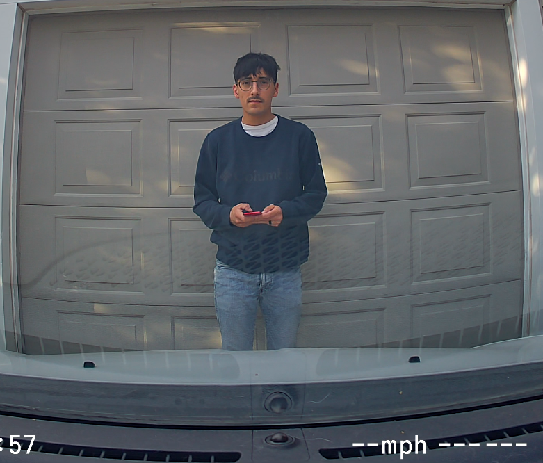
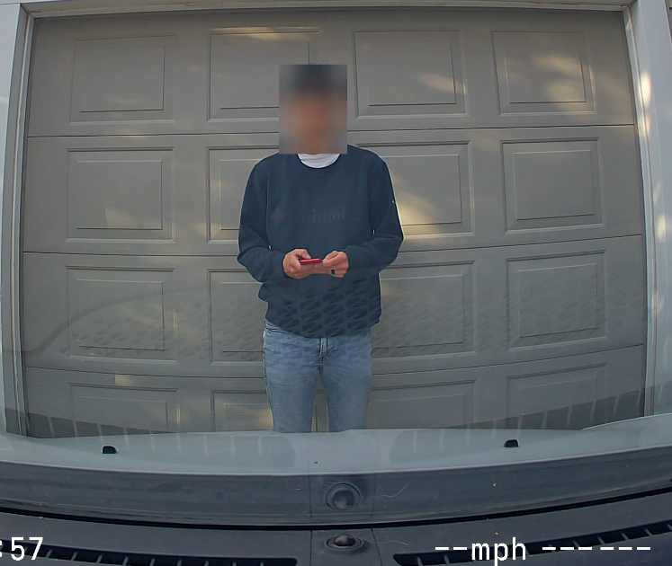

# Dashcam Daily Drives
A command-line tool for organizing and stitching dashcam footage into a single “drive of the day” video, with optional face-based privacy filtering (see limitations below).
Built as a personal project to explore video processing and computer vision workflows in Python.

## Why I built this
Dashcams generate a lot of small clips per drive.
I used this project to explore video processing tools like FFmpeg, and to experiment with organizing and stitching real-world footage into a single continuous video.
I also used it to learn about basic privacy filtering for shared dashcam footage, using pre-trained face detection models to blur identifiable details before exporting.

## Features
- Automatically scans a directory for dashcam video files
- Groups clips by recording date
- Sorts clips chronologically
- Optionally applies face detection and blur for privacy
- Efficiently stitches clips together using FFmpeg (no re-encoding)

## Limitations
The privacy filtering feature is designed specifically for face detection and blurring using OpenCV’s YuNet model. It does not detect or obscure other potentially identifiable features such as tattoos, clothing, license plates, or background identifiers.

As with most vision-based approaches, detection is not perfect and may occasionally miss faces depending on lighting, angle, or occlusion.

This tool is intended for educational and personal use to explore video processing and computer vision workflows, and is not designed for production-level privacy protection.

## Project Structure
```text
├── daily-drives.py
└── processor/
    ├── utils.py
    ├── detect.py
    ├── blur.py
    └── stitch.py
```

## Overview
- **daily-drives.py**  
  Entry point for the CLI. Handles user interaction and orchestrates the full processing pipeline.

- **processor/utils.py**  
  Responsible for file discovery, grouping clips by date, sorting them chronologically, and preparing output directories.

- **processor/detect.py**  
  Performs face detection using OpenCV’s YuNet (face_detection_yunet_2023mar) deep learning model.

- **processor/blur.py**  
  Applies frame-by-frame privacy filtering (face blurring) and writes processed video clips.

- **processor/stitch.py**  
  Combines video clips into a single output file using FFmpeg’s concat demuxer for fast, lossless stitching.

## Processing Flow
```text
→ group & sort (utils.py)
→ optional processing (blur.py + detect.py)
→ stitch clips (stitch.py)
→ final output video
```
## Model Setup
This project uses OpenCV's YuNet face detection model.

Download the model file and place it in:

`processor/models/`

Download link:
https://github.com/opencv/opencv_zoo/raw/main/models/face_detection_yunet/face_detection_yunet_2023mar.onnx

## Audio
Audio is preserved only when privacy filtering is disabled and present in the original clips.

When privacy filtering is enabled, video frames are processed using OpenCV. This step re-encodes the video and does not retain audio streams, so the final output will not contain audio.

This is a known limitation of the current pipeline design.
Future versions may address this by reattaching audio after processing.

## Codec Requirements
This project assumes that all input video clips share the same video and audio codecs, as well as consistent encoding parameters.

The stitching process uses FFmpeg’s concat demuxer with stream copy (`-c copy`), which does not re-encode media. As a result, all clips must be compatible at the container and codec level for successful concatenation.

### Required consistency between clips:
- Same video codec (e.g., H.264)
- Same audio codec (if present)
- Same frame rate
- Same resolution (recommended)
- Same encoding settings

If clips differ in these properties, FFmpeg may fail to stitch them correctly or may drop audio/video streams.

## Examples
### Visual output: privacy filtering

**Input (no privacy filtering)**



**Output (privacy mode enabled)**



**Short clip showing privacy filtering applied across frames**  


### CLI output (With privacy filtering applied)
```
$ python daily-drives.py

=== Dashcam Processor ===

Enter path to dashcam footage: E:\Normal\Front

Scanning for clips...

Available dates:
[1] 2026-04-17 (20 clips)
[2] 2026-04-18 (22 clips)
[3] 2026-04-19 (14 clips)
[4] 2026-04-20 (47 clips)
[5] 2026-04-22 (8 clips)

Select a date (1-5): 5

Selected date: 2026-04-22
Clips: 8 | Time range: 12:05:56 PM -> 02:15:26 PM

Apply privacy blurring? (y/n): y

Running privacy processing...

Processing clips (privacy filter)...
[1/8] Processing clip1.mp4
[2/8] Processing clip2.mp4
...
[8/8] Processing clip8.mp4

Stitching clips...
Cleaning up temporary files...

Output saved to: output/2026-04-22/final.mp4
Done!
Time elapsed: 02:35:43
```